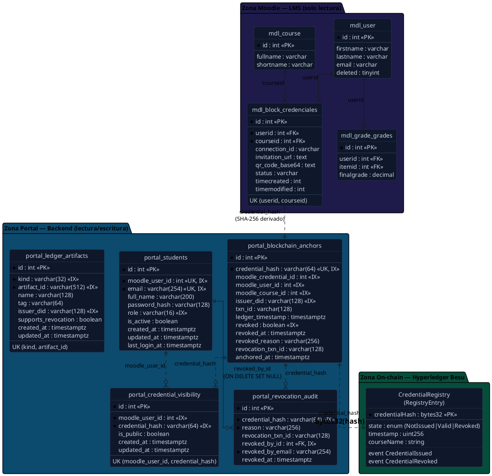

# Modelo de Datos y Políticas de Seguridad — Microcredenciales Blockchain (UTN)

> Documento de diseño: define el **modelo de datos** del sistema, el **diagrama
> relacional** (entidad-relación) que abarca las tres zonas de persistencia, y
> las **políticas de seguridad** que rigen la interacción entre los componentes.

---

## 1. Resumen

El sistema persiste información en **tres zonas** independientes que se unen por
una sola clave criptográfica: el **`credential_hash`** (SHA-256). Esta separación
es deliberada y constituye uno de los aportes centrales del trabajo, porque cada
zona cumple un rol distinto y tiene un dueño y un nivel de confianza diferentes:

| Zona | Motor | Acceso del backend | Rol |
| --- | --- | --- | --- |
| **Moodle (LMS)** | PostgreSQL | **Solo lectura** | Fuente de verdad de la *existencia* de la credencial (quién completó qué curso). |
| **Portal** | PostgreSQL | Lectura / escritura | Datos propios del sistema: usuarios, anclajes, visibilidad, auditoría. |
| **On-chain** | Hyperledger Besu (contrato `CredentialRegistry`) | Lectura / escritura vía Web3 | Fuente de verdad de la *validez* (emitida / revocada), inmutable y pública. |

> **Clave de unión.** El `credential_hash` se calcula de forma determinística como
> `SHA-256(student_id + course_id + completion_date + grade)` y es idéntico en las
> tres zonas. Esto garantiza una única identidad criptográfica de extremo a extremo:
> el mismo hash que se muestra en el portal es el que se ancla en la blockchain y el
> que un tercero verifica públicamente.

---

## 2. Diagrama relacional (PlantUML)

El siguiente diagrama está en **PlantUML** (sintaxis de *Information Engineering*).
Se puede renderizar con la extensión PlantUML de VS Code, en <https://www.plantuml.com/plantuml>
o con cualquier servidor PlantUML, y exportarse a PNG/SVG/PDF para la tesis.

> **Por qué algunas relaciones son punteadas (`..`).** Las uniones entre zonas no
> son claves foráneas físicas: enlazan bases de datos con dueños y ciclos de vida
> distintos (Moodle, Portal y la blockchain). La integridad se mantiene por el
> `credential_hash` determinístico, no por una restricción referencial del motor.
> Las relaciones sólidas (`--`) sí son FKs reales dentro de una misma base.

---

## 3. Diccionario de datos (Zona Portal)

Las tablas del portal se versionan con **Alembic** (migraciones `001`–`006`).

### 3.1 `portal_students`
Usuarios del portal, sincronizados desde Moodle en el primer ingreso.

| Columna | Tipo | Notas |
| --- | --- | --- |
| `id` | int | PK |
| `moodle_user_id` | int | Único. Vincula con `mdl_user.id`. |
| `email` | varchar(254) | Único. |
| `full_name` | varchar(200) | |
| `password_hash` | varchar(128) | Nullable hasta que el alumno define contraseña. |
| `role` | varchar(16) | `student` \| `admin`. Derivado de `is_siteadmin()` de Moodle. |
| `is_active` | boolean | Baja lógica. |
| `created_at` / `updated_at` / `last_login_at` | timestamptz | Auditoría temporal. |

### 3.2 `portal_blockchain_anchors`
Un registro por credencial anclada on-chain. Espejo local del estado de la
blockchain para enlaces directos al explorador y consultas rápidas.

| Columna | Tipo | Notas |
| --- | --- | --- |
| `credential_hash` | varchar(64) | Único. SHA-256, clave de unión entre zonas. |
| `txn_id` | varchar(128) | Hash de la transacción de **emisión**. |
| `revoked` | boolean | Estado de revocación (indexado). |
| `revoked_at` / `revoked_reason` | timestamptz / varchar(256) | Contexto de la revocación. |
| `revocation_txn_id` | varchar(128) | Hash de la transacción de **revocación**. |
| `issuer_did` | varchar(128) | `did:ethr:0x…` del emisor. |
| `ledger_timestamp` | timestamptz | Marca temporal on-chain. |

### 3.3 `portal_credential_visibility`
Opt-in del alumno a la visibilidad pública de cada credencial. Por defecto
**privada** (`is_public = false`).

| Columna | Tipo | Notas |
| --- | --- | --- |
| `moodle_user_id` + `credential_hash` | int + varchar(64) | Único en conjunto. |
| `is_public` | boolean | El alumno controla qué expone a terceros. |

### 3.4 `portal_revocation_audit`  *(nuevo — migración 006)*
Bitácora **append-only** (inmutable) de revocaciones, para trazabilidad.

| Columna | Tipo | Notas |
| --- | --- | --- |
| `credential_hash` | varchar(64) | Credencial revocada (indexado). |
| `reason` | varchar(256) | Motivo declarado por el administrador. |
| `revocation_txn_id` | varchar(128) | Transacción on-chain que prueba la revocación. |
| `revoked_by_id` | int | FK → `portal_students.id`, `ON DELETE SET NULL`. |
| `revoked_by_email` | varchar(254) | Denormalizado: sobrevive aunque se borre el admin. |
| `revoked_at` | timestamptz | Momento de la revocación. |

### 3.5 `portal_ledger_artifacts`
Artefactos institucionales del ledger (p. ej. la dirección del contrato
`CredentialRegistry` desplegado), para sobrevivir reinicios del backend.

---

## 4. Políticas de seguridad

Las políticas que rigen la interacción entre componentes se agrupan en cuatro ejes.

### 4.1 Autenticación
- **Portal (alumno/admin):** JWT `HS256` firmado con `PORTAL_JWT_SECRET`, con
  expiración configurable. El token se valida en cada request vía `OAuth2PasswordBearer`.
- **Moodle → Portal:** redirección con un JWT de un solo propósito firmado con
  `MOODLE_PORTAL_JWT_SECRET` (secreto distinto del de sesión).
- **Contraseñas:** se almacenan **hasheadas** (`password_hash`); política de
  complejidad mínima (≥ 8 caracteres, al menos una mayúscula y un número).
- El backend **falla al arrancar** si faltan los secretos críticos (`validate_config`).

### 4.2 Autorización
- **Control de acceso basado en roles (RBAC).** El guard `require_admin` exige
  `role == "admin"`. El rol **nunca** se concede por configuración estática: la
  única fuente de verdad es Moodle (`is_siteadmin()`), propagado en el JWT.
- Las operaciones sensibles (revocar, listar todas las credenciales, auditoría)
  están detrás de `require_admin`. Un alumno recibe `403`.
- **Aislamiento on-chain:** el contrato `CredentialRegistry` aplica `onlyOwner`
  sobre `issueCredential` y `revokeCredential`; sólo la cuenta de la institución
  emite o revoca, con independencia de la capa de aplicación.

### 4.3 Privacidad (minimización de datos)
- **Privado por defecto.** Una credencial sólo expone datos personales si el
  alumno hizo *opt-in* explícito (`portal_credential_visibility.is_public`).
- En la verificación pública de una credencial **privada**, se confirma su validez
  y la evidencia on-chain (que es pública e inmutable) **sin revelar** el nombre
  del alumno ni datos personales.
- Una credencial **revocada nunca** divulga identidad, aun siendo pública: el
  nombre sólo se muestra cuando el veredicto es `VALID`.
- La base de datos de Moodle se accede en modo **solo lectura**
  (`postgresql_readonly`), evitando cualquier escritura accidental sobre el LMS.

### 4.4 Integridad y verificación por terceros
- **Fuente de verdad de la validez = blockchain.** El veredicto público se deriva
  del estado on-chain, no de la mera existencia en Moodle:

  | Estado on-chain | Veredicto público | `valid` |
  | --- | --- | --- |
  | `Valid` (anclada) | `VALID` | `true` |
  | `Revoked` | `REVOKED` | `false` |
  | sin prueba on-chain confirmada | `NOT_ANCHORED` | `false` |
  | hash sin coincidencia | `NOT_FOUND` | `false` |

- **Inmutabilidad:** la emisión y la revocación quedan registradas como eventos
  (`CredentialIssued`, `CredentialRevoked`) en la blockchain, verificables de forma
  independiente en el explorador **Blockscout** mediante un *deep-link* directo a
  la transacción que define el estado actual.
- **Identidad criptográfica única:** el `credential_hash` es determinístico e
  idéntico en portal, on-chain y verificación pública, de modo que cualquier
  alteración de los datos de origen produce un hash distinto y rompe la verificación.
- **Trazabilidad:** toda revocación deja un registro inmutable en
  `portal_revocation_audit` (quién, cuándo, por qué y con qué transacción).

---

## 5. Trazabilidad con el código

| Concepto | Archivo |
| --- | --- |
| Modelos ORM del portal | `backend/controller/portal/models.py` |
| Migraciones | `backend/controller/alembic/versions/001…006_*.py` |
| Cálculo del hash canónico | `backend/controller/utils/hashing.py` |
| Contrato inteligente | `backend/contracts/CredentialRegistry.sol` |
| Regla de estado on-chain → veredicto | `backend/controller/blockchain/base.py` (`state_to_anchor_status`) |
| Verificación pública (terceros) | `backend/controller/portal/public_endpoints.py` |
| Revocación + auditoría | `backend/controller/portal/revocation_endpoints.py` |
| Tabla del plugin Moodle | `moodle/moodle-plugin/credenciales/db/install.xml` |
